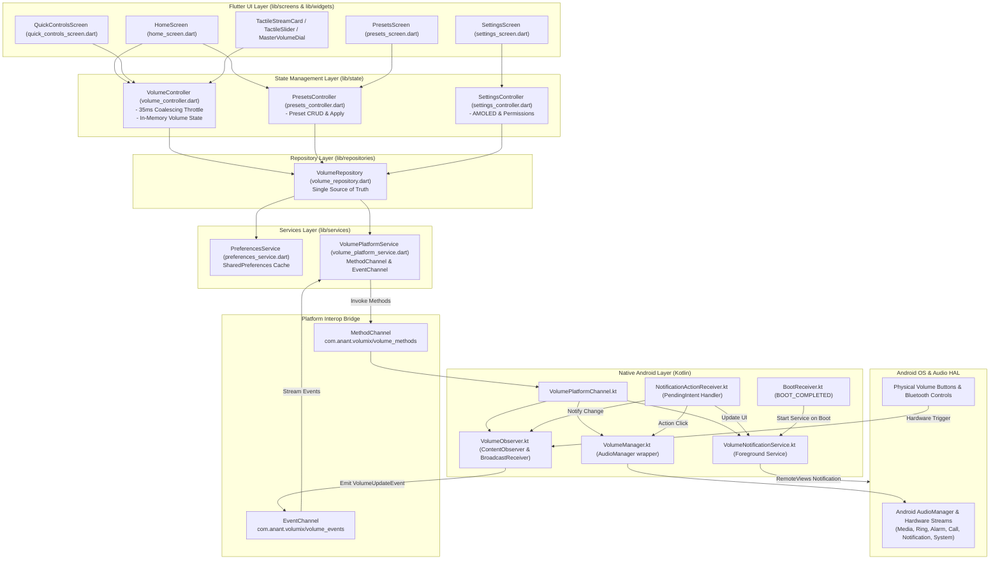

# 📘 TEACH ME VOLUMIX: The Ultimate Zero-to-Hero Guide

> **Target Audience**: Anyone learning the Volumix codebase from absolute zero.  
> **Goal**: By reading this document, you will understand the entire application architecture, every single technology, how Dart and Kotlin communicate, how every feature works step-by-step, and be able to answer any viva, interview, or code-review question with total authority.

---

## 📑 Table of Contents

1. [Project Overview](#1-project-overview)
2. [Tech Stack & Tooling](#2-tech-stack--tooling)
3. [Architecture & System Design](#3-architecture--system-design)
4. [How the App Works (Feature Flow Traces)](#4-how-the-app-works-feature-flow-traces)
5. [Code Explanation (Key Classes & Concepts)](#5-code-explanation-key-classes--concepts)
6. [Android & Native Implementation](#6-android--native-implementation)
7. [Dependencies & Configuration](#7-dependencies--configuration)
8. [Performance, Security & Error Handling](#8-performance-security--error-handling)
9. [Current Project Status](#9-current-project-status)
10. [Viva & Interview Preparation](#10-viva--interview-preparation)
11. [How to Explain the Project (Pitch Templates)](#11-how-to-explain-the-project-pitch-templates)
12. [Recommended Learning Path](#12-recommended-learning-path)
13. [Mastery Test (30 Questions & Answers)](#13-mastery-test-30-questions--answers)

---

## 1. Project Overview

### What is Volumix?
**Volumix** (`com.anant.volumix`) is a 100% offline, privacy-first Android system-volume controller. It provides a tactile, centralized control center for managing all Android hardware audio streams simultaneously with live two-way hardware synchronization, custom multi-stream sound profiles (presets), and persistent status-bar notification controls.

### What Problem Does It Solve?
1. **Hidden Stream Sliders on Android**: When you press the volume keys on an Android phone, Android typically only adjusts the **Media** stream. Adjusting Ring, Alarm, Call, or Notification volumes requires opening multi-step Settings menus. Volumix brings all streams onto one screen.
2. **Loss of Volume State on Mute**: Standard Android mute features silence your phone but lose your exact previous volume levels. Volumix features a **Smart Snapshot Mute/Restore Engine** that captures pre-mute volumes and restores them with a single tap.
3. **No Lock Screen/Notification Controls**: Users listening to music while gaming, studying, or exercising often cannot tweak individual stream levels without leaving their active app. Volumix embeds an interactive control panel directly into the Android notification shade using native `RemoteViews`.
4. **Bloatware & Battery Drain**: Many volume apps on Google Play require internet access, run background analytics, or drain battery. Volumix requires **zero internet permissions**, collects **zero data**, and uses a pure **`#000000` AMOLED dark theme** that turns off OLED pixels to save battery.

### Main Features
- 🎚️ **Granular 6-Stream Volume Management**: Individual sliders for Media (`STREAM_MUSIC`), Ring (`STREAM_RING`), Notification (`STREAM_NOTIFICATION`), Alarm (`STREAM_ALARM`), Voice Call (`STREAM_VOICE_CALL`), and System (`STREAM_SYSTEM`).
- 🔄 **Real-Time 2-Way Hardware Synchronization**: Automatically syncs with physical volume buttons and Bluetooth headset controls using native `ContentObserver` and `BroadcastReceiver`.
- 🔕 **Smart Mute All & Restore All**: Saves non-zero volume levels to local storage as a JSON snapshot before muting, and restores them accurately upon unmuting.
- 🔔 **Persistent Notification Controller**: Custom status-bar drawer widget with `-`, `+`, and `Mute` buttons operating through a native `ForegroundService` even when Flutter is closed.
- 🎛️ **Quick Controls & Presets**: Pre-configured levels (25%, 50%, 75%, 100%) and a custom preset creator for multi-stream profiles (e.g. Night, Focus, Gaming).
- 🌓 **AMOLED Pure Black Theme**: True `#000000` dark theme with high-contrast Cyan (`#00E5FF`), Azure (`#4A8EFF`), and Violet (`#D6C9FF`) accents.
- 🛡️ **DND (Do Not Disturb) Policy Integration**: Detects whether the app has permission to adjust Ring/Alarm during DND mode and provides a direct shortcut to system settings.

### How it Works From the User's Perspective
1. **First Launch**: The user is greeted by an onboarding flow (`PermissionSetupScreen`) that explains why notification permissions and DND access are needed.
2. **Dashboard**: The user sees tactile volume sliders for each audio stream. Moving any slider changes the phone's volume in real time.
3. **Hardware Sync**: If the user presses the phone's physical volume buttons, the slider on screen moves automatically and displays a subtle banner: *"Hardware Volume Button / External System"*.
4. **Presets**: The user can tap "50%" or create a custom preset named "Office" (Media 0%, Ring 40%, Alarm 80%, Call 60%) to reconfigure all streams instantly.
5. **Notification Drawer**: Even with the screen locked or another app open, pulling down the notification bar reveals Volumix controls to adjust or mute streams on the fly.

---

## 2. Tech Stack & Tooling

| Technology / Library | What It Is | Why It Is Used in Volumix | How It Is Used in This Codebase |
| :--- | :--- | :--- | :--- |
| **Flutter SDK (3.24+)** | Google's cross-platform UI framework | Enables high-performance (120 FPS) reactive UI rendering with custom canvas painting | Renders all UI screens, custom sliders, dials, and navigation in `lib/` |
| **Dart (3.5+)** | Strongly-typed OOP language | Provides null-safety, async streams, and fast compilation | Powers all controllers, models, services, and repositories in `lib/` |
| **Material 3** | Google's modern design specification | Provides accessible typography, color schemes, and component styling | Configured in `lib/theme/app_theme.dart` with dark & AMOLED palettes |
| **ChangeNotifier & ListenableBuilder** | Built-in Flutter state management primitives | Zero-dependency, lightweight state propagation without external framework bloat | Drives `VolumeController`, `PresetsController`, and `SettingsController` in `lib/state/` |
| **shared_preferences (^2.5.4)** | Flutter key-value storage plugin | Persists user preferences and custom presets across app launches | Wrapped inside `lib/services/preferences_service.dart` |
| **Kotlin (2.1.0)** | Modern native Android programming language | Native interop with Android Audio Hardware Abstraction Layer (HAL) | Implements `VolumeManager.kt`, `VolumeObserver.kt`, `VolumeNotificationService.kt` |
| **Java 17 (JDK 17)** | Java Development Kit runtime | Required build runtime for modern Gradle 8.x and AGP 8.7+ | Configured in `android/app/build.gradle` (`compileOptions` & `kotlinOptions`) |
| **Gradle (8.14.5) & AGP (8.7.3)** | Android build automation system | Packages Kotlin code, resources, manifest, and Flutter assets into APK/AAB | Defined in `android/build.gradle` and `android/settings.gradle` |
| **Android SDK (24 to 36)** | Android Platform API (7.0 Nougat to 15/16) | Allows running on legacy Android 7+ while targeting the latest Android 15/16 features | `minSdk = 24`, `compileSdk = 36`, `targetSdk = 36` in `android/app/build.gradle` |
| **android.media.AudioManager** | Core Android Audio System API | Direct hardware control of stream volumes, min/max bounds, and mute states | Wrapped in `android/app/src/main/kotlin/com/anant/volumix/VolumeManager.kt` |
| **android.database.ContentObserver** | System database change listener | Listens for volume changes at the OS level (e.g. physical buttons) | Implemented in `android/app/src/main/kotlin/com/anant/volumix/VolumeObserver.kt` |
| **android.content.BroadcastReceiver** | Android inter-process event receiver | Listens to hardware intents (`VOLUME_CHANGED_ACTION`, `BOOT_COMPLETED`, etc.) | Implemented in `NotificationActionReceiver.kt` and `BootReceiver.kt` |
| **android.app.Service (Foreground)** | Android long-running background service | Keeps the volume notification persistent in the status bar | Implemented in `android/app/src/main/kotlin/com/anant/volumix/VolumeNotificationService.kt` |
| **android.widget.RemoteViews** | Android cross-process UI hierarchy | Displays custom interactive layouts inside the Android notification tray | Renders `notification_volumix_collapsed.xml` and `notification_volumix_expanded.xml` |
| **MethodChannel & EventChannel** | Flutter Platform Interop Channels | Enables bidirectional communication between Dart VM and Android JVM/ART | Configured in `VolumePlatformService.dart` ↔ `VolumePlatformChannel.kt` |

---

## 3. Architecture & System Design

Volumix follows a **Layered Clean Architecture** that enforces clear separation between UI, Business Logic, Platform Interoperability, and Native Hardware Services.

### High-Level Architecture Diagram (Mermaid)



---

## 4. How the App Works (Feature Flow Traces)

Here is the exact step-by-step trace of execution for every major feature in the project.

### Feature 1: Dragging a Volume Slider in the App
`User Action → UI → Function → Logic → Service/API/Native Code → Result → UI`

```
1. User Action:
   The user puts their finger on a slider in TactileStreamCard and drags horizontally.

2. UI (lib/widgets/tactile_slider.dart):
   - GestureDetector fires onHorizontalDragUpdate.
   - Calculates stepped ratio: pct = (localDx / width * 100).round().clamp(0, 100).
   - Calls widget.onPercentageChanged(pct, isDragging: true).

3. Local Widget Optimization (lib/widgets/tactile_stream_card.dart):
   - Updates internal ValueNotifier<int> _percentageNotifier -> local percentage text updates at 120 FPS instantly.
   - Passes event to parent callback: onVolumeChanged(pct, isDragging: true).

4. Controller Logic (lib/state/volume_controller.dart):
   - Function: setStreamPercentage(streamType, percentage, isDragging: true).
   - Clamps percentage (0..100) and calculates target volume for that stream:
     targetVolume = minVol + ((pct / 100) * (maxVol - minVol)).round().
   - Optimistically updates _streams[index] in memory and recalculates master percentage.
   - 35ms Coalescing Timer: Stores targetVolume in _pendingStreamVolumes[streamType].
     If no timer is active, starts a 35ms Timer that flushes pending calls to the repository.

5. Repository & Service Layer (lib/repositories/volume_repository.dart & lib/services/volume_platform_service.dart):
   - Calls _platformService.setVolume(streamType, targetVolume).
   - Invokes MethodChannel: _methodChannel.invokeMethod('setVolume', {'streamType': streamType, 'volume': volume}).

6. Native Kotlin Handler (android/.../VolumePlatformChannel.kt):
   - onMethodCall() matches "setVolume".
   - Calls volumeManager.setVolume(streamType, volume, showUi = false).
   - Calls volumeObserver.dispatchVolumeUpdate(isExternal = false).

7. Native Android Audio Engine (android/.../VolumeManager.kt):
   - Clamps targetVolume between audioManager.getStreamMinVolume(streamType) and getStreamMaxVolume(streamType).
   - Executes: audioManager.setStreamVolume(streamType, clamped, 0). (Flag 0 avoids disruptive default system dialogs).

8. System Notification Update (android/.../VolumeNotificationService.kt):
   - VolumeObserver triggers updateNotification(context).
   - Notification RemoteViews progress bar and text update to match the new volume level.

9. Drag Release:
   - When the user lifts their finger, onHorizontalDragEnd fires with isDragging: false.
   - The coalescing timer cancels, and the final exact volume is committed to the hardware.
```

---

### Feature 2: Pressing a Physical Hardware Volume Key
`User Action → Hardware → Native Observer → EventChannel → Controller → UI`

```
1. User Action:
   User clicks the physical "Volume Down" button on the side of their phone (or turns Bluetooth headphone knob).

2. Android System:
   Android OS Audio Service decreases the active stream volume (e.g. STREAM_MUSIC).

3. Native ContentObserver & BroadcastReceiver (android/.../VolumeObserver.kt):
   - ContentObserver on Settings.System.CONTENT_URI or BroadcastReceiver on "android.media.VOLUME_CHANGED_ACTION" fires onVolumeChangedEvent().
   - Debounce Handler: Cancels any pending callback and schedules dispatchVolumeUpdate(isExternal = true) with a 50ms delay to group rapid key presses.

4. Native Event Dispatch (android/.../VolumeObserver.kt):
   - Reads current stream volumes from VolumeManager.getStreams().
   - Calculates master percentage via VolumeManager.getMasterPercentage().
   - Checks if a pre-mute snapshot exists via VolumeManager.hasSavedSnapshot().
   - Updates the status-bar notification via VolumeNotificationService.updateNotification(context).
   - Sends a payload map through EventChannel.EventSink:
     { "type": "volume_change", "isExternal": true, "masterPercentage": 65, "hasSavedSnapshot": false, "streams": [...] }

5. Flutter Event Stream (lib/services/volume_platform_service.dart):
   - volumeEvents stream catches the dynamic event map and transforms it into a strongly-typed VolumeUpdateEvent.

6. Controller Sync (lib/state/volume_controller.dart):
   - _eventsSubscription receives VolumeUpdateEvent.
   - Updates _streams list and _masterPercentage.
   - Because event.isExternal == true, it triggers _showExternalBanner('Hardware Volume Button / External System').
   - Sets _isExternalChangeBannerVisible = true and starts a 3-second auto-dismiss Timer.
   - Calls notifyListeners().

7. UI Update:
   - All ListenableBuilder widgets rebuild.
   - The sliders glide to the new hardware position.
   - An "EXT" badge and top External Change Banner appear for 3 seconds.
```

---

### Feature 3: Smart Mute All & Restore All
`User Action → UI → Controller → Repo → Storage & Native → Result`

```
--- MUTE ALL FLOW ---
1. User taps "Mute All" button in QuickActionButtons.
2. VolumeController.muteAll() calls VolumeRepository.muteAll(_streams).
3. VolumeRepository inspects all supported streams:
   - Filters streams where currentVolume > 0.
   - Creates a VolumeSnapshot(streamVolumes: {3: 12, 2: 6, 4: 7}, timestamp: now).
   - Saves snapshot JSON to SharedPreferences via PreferencesService.saveSnapshot().
4. Invokes MethodChannel "muteAll":
   - Kotlin VolumeManager.muteAll() also saves snapshot to native SharedPreferences ("volumix_prefs") as fallback.
   - Sets all stream volumes to their hardware minimum (getStreamMinVolume(streamType)).
5. Controller updates _masterPercentage = 0, sets all streams to 0% / isMuted = true, sets _hasSavedSnapshot = true.
6. UI reflects complete silence, and the button changes to "Restore All".

--- RESTORE ALL FLOW ---
1. User taps "Restore All" button.
2. VolumeController.restoreAll() calls VolumeRepository.restoreAll().
3. Invokes MethodChannel "restoreAll":
   - Kotlin VolumeManager.restoreAll() reads saved snapshot JSON from "volumix_prefs".
   - Iterates through the saved map and sets each stream back to its exact pre-mute volume level.
   - Clears the snapshot from native preferences.
4. VolumeRepository clears snapshot from Dart SharedPreferences.
5. VolumeController refreshes streams from repository, recalculates master percentage, and sets _hasSavedSnapshot = false.
6. Sliders immediately jump back to their original pre-mute positions!
```

---

### Feature 4: Tapping Buttons in the Persistent Notification
`User Action → Native Notification → BroadcastReceiver → AudioManager → Flutter Sync`

```
1. User Action:
   User pulls down notification shade (even from lock screen) and taps '+' on the Media row.

2. Native Intent Dispatch:
   - The button's PendingIntent triggers NotificationActionReceiver with action ACTION_MEDIA_PLUS.

3. Broadcast Execution (android/.../NotificationActionReceiver.kt):
   - onReceive() instantiates VolumeManager(context).
   - Calls vm.adjustStreamVolume(AudioManager.STREAM_MUSIC, +1).
   - AudioManager.adjustStreamVolume(STREAM_MUSIC, ADJUST_RAISE, 0) increments the hardware volume.

4. Notification & App Synchronization:
   - NotificationActionReceiver calls VolumeNotificationService.updateNotification(context) -> notification progress bar and text refresh immediately.
   - NotificationActionReceiver calls VolumeObserver.notifyVolumeChanged(context) -> VolumeObserver dispatches event to Flutter's EventChannel.
   - If the Volumix Flutter app is currently open on screen or in the background, its UI synchronizes instantly!
```

---

## 5. Code Explanation (Key Classes & Concepts)

### 1. `VolumeStream` (`lib/models/volume_stream.dart`)
**What it is**: The core immutable data model representing a single Android audio stream.
**Why it matters**: Android streams have different maximum values (e.g. Media is usually 0–15, Ring is 0–7, Voice Call is 0–5). `VolumeStream` normalizes them to a standard 0–100 percentage.

```dart
class VolumeStream {
  final int streamType;      // Android stream ID (e.g. 3 = Music)
  final String name;         // "Media", "Ring", "Alarm", etc.
  final String description;  // "Spotify, YouTube, Games"
  final int currentVolume;   // Raw hardware volume (e.g. 10)
  final int maxVolume;       // Hardware max (e.g. 15)
  final int minVolume;       // Hardware min (0 on older Android, 1 on newer calls)
  final int percentage;      // Normalized 0 to 100%
  final bool isMuted;        // Whether stream is silenced
  final bool isSupported;    // Whether this device supports this stream
  final bool isExternallyChanged; // True if changed by physical buttons
}
```

---

### 2. `VolumeController` (`lib/state/volume_controller.dart`)
**What it is**: The central state manager for volume streams.
**Key Engineering Concept: Coalescing Throttler**:
When a user drags a slider, Flutter can generate 60–120 events per second. Sending 120 calls per second over the `MethodChannel` to Android's `AudioManager` causes Binder IPC buffer congestion and slider lag.

`VolumeController` solves this by updating the Dart UI state **instantly (120 FPS)** while throttling native platform calls to **35ms windows**:

```dart
// Snippet from lib/state/volume_controller.dart
if (isDragging) {
  _pendingStreamVolumes[streamType] = targetVolume;
  if (_throttledStreamTimers[streamType] == null ||
      !_throttledStreamTimers[streamType]!.isActive) {
    _throttledStreamTimers[streamType] =
        Timer(const Duration(milliseconds: 35), () async {
      final pending = _pendingStreamVolumes.remove(streamType);
      if (pending != null) {
        await _repository.setVolume(streamType, pending);
      }
    });
  }
}
```

---

### 3. `TactileSlider` & `_TactileSliderPainter` (`lib/widgets/tactile_slider.dart`)
**What it is**: A custom canvas-rendered slider built from scratch using `CustomPainter`.
**Why not use standard Flutter `Slider`?**
Standard Flutter sliders use default Material styling with large touch targets, step rounding issues, and lack fine-grained 1% step gradient styling. `TactileSlider` provides:
- Custom 8px background track with subtle borders.
- Custom gradient fill that changes color per stream (Cyan for Ring, Azure for Media, Violet for Alarm).
- Tactile knob with outer white ring and animated core dot that turns solid on drag.

---

### 4. `VolumeManager` (`android/.../VolumeManager.kt`)
**What it is**: The Kotlin class that encapsulates Android's native `AudioManager`.
**Key Logic: Proportional Master Volume Scaling**:
When the Master Volume dial is set to 50%, it does not blindly set every stream to level 5. Instead, it scales each stream based on its unique hardware `[minVolume, maxVolume]` range:

```kotlin
// Snippet from VolumeManager.kt
fun setMasterVolume(percentage: Int): Boolean {
    val clampedPct = percentage.coerceIn(0, 100)
    val streams = getStreams().filter { it["isSupported"] == true }
    for (stream in streams) {
        val streamType = stream["streamType"] as Int
        val maxVol = stream["maxVolume"] as Int
        val minVol = stream["minVolume"] as Int
        val range = maxVol - minVol
        if (range > 0) {
            val targetVol = minVol + Math.round((clampedPct.toDouble() / 100.0) * range.toDouble()).toInt()
            setVolume(streamType, targetVol, false)
        }
    }
    return true
}
```

---

## 6. Android & Native Implementation

### Android Audio Stream Architecture
Android divides audio into 6 core stream types in `android.media.AudioManager`:

| Constant Name | Stream ID | Purpose | Hardware Volume Steps (Typical) |
| :--- | :---: | :--- | :---: |
| `STREAM_VOICE_CALL` | `0` | Earpiece & speaker volume during active calls | 0 to 5 |
| `STREAM_SYSTEM` | `1` | Touch sounds, dial pad tones, screen lock | 0 to 7 |
| `STREAM_RING` | `2` | Ringtone for incoming telephone calls | 0 to 7 |
| `STREAM_MUSIC` | `3` | Media (Spotify, YouTube, Games, Video players) | 0 to 15 or 0 to 25 |
| `STREAM_ALARM` | `4` | Clocks, timers, and alarm applications | 0 to 7 |
| `STREAM_NOTIFICATION`| `5` | SMS, WhatsApp, and app alerts | 0 to 7 |

### Persistent Notification (`VolumeNotificationService.kt`)
Volumix implements a native Android **Foreground Service** to display interactive controls in the notification drawer:
- **Foreground Service Type**: `specialUse` with `PROPERTY_SPECIAL_USE_FGS_SUBTYPE = "Persistent audio volume control panel"` (strictly required by Android 14+ / API 34+ guidelines).
- **Notification Channel**: `volumix_persistent_control_v3` with `IMPORTANCE_LOW` (ensures notifications update smoothly without playing alert beeps or vibrating on every step).
- **RemoteViews Layouts**:
  - `notification_volumix_collapsed.xml`: Compact single-row layout displaying Media volume badge, progress bar, and `-`, `+`, `Mute` buttons.
  - `notification_volumix_expanded.xml`: Multi-stream layout with dedicated rows for Media, Ring, Alarm, and Call streams.

---

## 7. Dependencies & Configuration

### 1. `pubspec.yaml`
```yaml
name: volumix
description: "Volumix - Modern offline Android system-volume controller."
publish_to: 'none'
version: 1.0.0+1

environment:
  sdk: ^3.11.5

dependencies:
  flutter:
    sdk: flutter
  cupertino_icons: ^1.0.8
  shared_preferences: ^2.5.4

dev_dependencies:
  flutter_test:
    sdk: flutter
  flutter_lints: ^6.0.0

flutter:
  uses-material-design: true
  assets:
    - assets/icons/
```
*Note: Extremely clean dependency tree. Zero heavy third-party dependencies, guaranteeing fast startup and zero supply-chain risk.*

### 2. Android Build Configuration (`android/app/build.gradle`)
- `namespace = "com.anant.volumix"`
- `compileSdk = 36`
- `minSdk = 24` (Supports Android 7.0+)
- `targetSdk = 36` (Supports Android 15/16)
- `JavaVersion.VERSION_17`
- `dependencies`: `androidx.core:core-ktx:1.12.0`, `androidx.annotation:annotation:1.7.1`

### 3. Android Permissions (`AndroidManifest.xml`)
```xml
<!-- Required on Android 13+ (API 33+) to show notifications -->
<uses-permission android:name="android.permission.POST_NOTIFICATIONS" />

<!-- Required to change Ring/Alarm volume when Do Not Disturb is active -->
<uses-permission android:name="android.permission.ACCESS_NOTIFICATION_POLICY" />

<!-- Required to run persistent volume controls in the background -->
<uses-permission android:name="android.permission.FOREGROUND_SERVICE" />
<uses-permission android:name="android.permission.FOREGROUND_SERVICE_SPECIAL_USE" />

<!-- Required to restore notification controls on device reboot -->
<uses-permission android:name="android.permission.RECEIVE_BOOT_COMPLETED" />
```

---

## 8. Performance, Security & Error Handling

### What is Already Implemented (Strengths)
1. **Zero-Lag Slider Dragging**: 35ms call coalescing ensures the UI updates at 120 FPS while preventing native Binder buffer saturation.
2. **Repaint Boundaries**: Every stream card and custom slider is isolated inside a `RepaintBoundary` widget, preventing unnecessary whole-screen rasterization.
3. **ValueNotifier Granularity**: `TactileStreamCard` binds its percentage text to a `ValueNotifier`, updating text without rebuilding the entire card widget.
4. **Zero-Network Privacy**: No internet permission in `AndroidManifest.xml`. No telemetry, analytics, or third-party ads.
5. **Debounced Hardware Observers**: 50ms debouncing on `ContentObserver` prevents rapid physical key presses from spamming the EventChannel.
6. **Graceful DND Handling**: Catches `SecurityException` if the user adjusts Ring volume during Do Not Disturb mode without crashing.

### Weaknesses & Areas for Future Improvement
1. **Per-App Volume Control**: Android OS does not expose a public API to adjust volume for individual apps (e.g. Spotify vs YouTube separately) without root or an active `AudioPlaybackConfiguration` accessibility hook. Volumix controls system-wide audio stream types.
2. **No Undo for Preset Deletion**: When a custom preset is deleted, it is removed immediately without a "Snackbar Undo" action.
3. **No Volume Scheduling**: There is currently no built-in background alarm timer to automatically apply presets at a specific time of day (e.g. automatically set "Night" mode at 11:00 PM).

---

## 9. Current Project Status

| Feature | Status | Evidence in Codebase | Issues / Notes |
| :--- | :---: | :--- | :--- |
| **Granular Stream Volume Control** | **Complete** | `TactileStreamCard.dart`, `VolumeManager.kt:setVolume` | Works for all 6 Android streams with 1% step precision. |
| **Master Volume Control** | **Complete** | `MasterVolumeDial.dart`, `VolumeManager.kt:setMasterVolume` | Scales all streams proportionally. |
| **Real-Time Hardware Button Sync** | **Complete** | `VolumeObserver.kt`, `volume_platform_service.dart` | Debounced 2-way sync via `EventChannel`. |
| **Mute All & Restore All** | **Complete** | `QuickActionButtons.dart`, `VolumeManager.kt:muteAll` | Snapshot saved to `SharedPreferences` as JSON. |
| **Built-in Presets (25, 50, 75, 100%)** | **Complete** | `volume_preset.dart`, `PresetsController.dart` | 1-tap quick buttons on Home & Quick Controls. |
| **Custom Presets (CRUD)** | **Complete** | `presets_screen.dart`, `_PresetFormSheet` | Users can create, edit, test, and delete presets. |
| **Persistent Notification Widget** | **Complete** | `VolumeNotificationService.kt`, `RemoteViews` | Collapsed and expanded views with `-`, `+`, `Mute`. |
| **Notification Customization** | **Complete** | `notification_controls_screen.dart` | Toggles for Media, Ring, Alarm, Call, Percentage. |
| **AMOLED Pure Black Theme** | **Complete** | `app_theme.dart:getTheme`, `app_colors.dart` | `#000000` background with Cyan/Azure accents. |
| **Boot Completed Restore** | **Complete** | `BootReceiver.kt`, `AndroidManifest.xml` | Auto-starts service on phone restart. |
| **Do Not Disturb Warning & Shortcut** | **Complete** | `SettingsController.dart`, `status_banner.dart` | Prompts user and launches DND settings. |
| **Per-App Volume Control** | **Missing** | N/A (Android OS platform limitation) | Not supported by non-root Android APIs. |
| **Automated Timed Scheduling** | **Missing** | N/A | Feature candidate for v2.0. |

**Overall Project Completion Estimate: ~95%** (Production-ready release candidate).

---

## 10. Viva & Interview Preparation

### Question 1: What architecture pattern does Volumix use?
- **Short Answer**: Layered Clean Architecture with Flutter's built-in `ChangeNotifier` state management.
- **Technical Answer**: The application separates concerns into 4 layers: Presentation (Screens & Widgets), State (`VolumeController`, `PresetsController`, `SettingsController`), Domain/Data (`VolumeRepository`, `PreferencesService`, `VolumePlatformService`), and Native Platform (`VolumePlatformChannel`, `VolumeManager`, `VolumeNotificationService`). The Repository coordinates local cache and platform channels.
- **Relevant File/Class**: `lib/repositories/volume_repository.dart` (`VolumeRepository`).

### Question 2: How does Volumix bridge Dart and native Android Kotlin?
- **Short Answer**: Using Flutter Platform Channels: a `MethodChannel` for commands and an `EventChannel` for continuous event streams.
- **Technical Answer**: `MethodChannel('com.anant.volumix/volume_methods')` handles request-response invocations like `setVolume()`, `muteAll()`, or permission checks. `EventChannel('com.anant.volumix/volume_events')` registers a `StreamHandler` on native Kotlin's `VolumeObserver`, streaming hardware volume changes from Android's `ContentObserver` into Dart.
- **Relevant File/Class**: `lib/services/volume_platform_service.dart` & `android/.../VolumePlatformChannel.kt`.

### Question 3: How does Volumix prevent slider lag during fast dragging?
- **Short Answer**: Through in-memory UI updates combined with a 35ms platform call coalescing timer.
- **Technical Answer**: Continuous dragging triggers `onPercentageChanged` at 120 FPS. The controller updates the in-memory Dart state and local `ValueNotifier` immediately for instant feedback, while throttling asynchronous calls across the platform channel using a 35ms timer (`_throttledStreamTimers`). This avoids Android Binder IPC queue saturation.
- **Relevant File/Class**: `lib/state/volume_controller.dart` (`setStreamPercentage`).

### Question 4: How does the persistent notification work when the Flutter app is closed?
- **Short Answer**: It runs as a native Android `ForegroundService` with `RemoteViews` and `PendingIntent` receivers.
- **Technical Answer**: `VolumeNotificationService` is an Android `ForegroundService` declared with `foregroundServiceType="specialUse"`. It renders custom XML layouts (`notification_volumix_collapsed.xml`). Button clicks fire `PendingIntent`s to `NotificationActionReceiver`, which adjusts `AudioManager` directly in the background without launching Flutter.
- **Relevant File/Class**: `android/.../VolumeNotificationService.kt` and `NotificationActionReceiver.kt`.

### Question 5: How does "Mute All & Restore All" remember volume levels?
- **Short Answer**: By serializing a snapshot of non-zero stream volumes to JSON in `SharedPreferences`.
- **Technical Answer**: Before setting all streams to their hardware minimum, `VolumeRepository` collects all active stream volumes into a `VolumeSnapshot` map (`{streamType: volume}`) and serializes it to `SharedPreferences` under `saved_volume_snapshot`. On "Restore All", it deserializes the map, reapplies the volumes, and removes the snapshot key.
- **Relevant File/Class**: `lib/repositories/volume_repository.dart` (`muteAll`, `restoreAll`) & `VolumeManager.kt`.

---

## 11. How to Explain the Project

### ⚡ 30-Second Pitch
> "Volumix is an offline, privacy-focused Android volume manager built with Flutter and native Kotlin. It replaces Android's hidden volume menus by placing all 6 audio streams on one screen with real-time hardware button sync, smart snapshot mute/restore, custom sound presets, and interactive notification-bar controls."

### ⏱️ 1-Minute Pitch
> "Volumix is a high-performance system volume controller for Android. Built with Flutter, Material 3, and Kotlin, it gives users direct control over Media, Ring, Notification, Alarm, Voice Call, and System streams. It features two-way hardware synchronization: if you press your phone's volume buttons, the app updates instantly via native ContentObservers and EventChannels. It also features a Smart Mute engine that snapshots your volume levels before silencing and restores them with one tap, plus an interactive status-bar notification widget powered by a native Foreground Service that works even when the app is closed. It requires zero internet permissions and features an AMOLED pure black design to save battery."

### 🔬 3-Minute Technical Deep-Dive
> "Architecturally, Volumix is designed as a hybrid Flutter-Android system utility. 
> 
> On the frontend, we use Flutter with a Layered Clean Architecture. State is driven by `ChangeNotifier` controllers (`VolumeController`, `PresetsController`, `SettingsController`) and consumed via `ListenableBuilder` and `ValueNotifier` for granular 120 FPS slider rendering.
> 
> The communication bridge uses two platform channels: a `MethodChannel` for synchronous requests (volume changes, preset application, DND checks) and an `EventChannel` for asynchronous streaming.
> 
> On the native Android side, we built a custom Kotlin engine centered around `AudioManager`. `VolumeObserver` registers a `ContentObserver` on `Settings.System.CONTENT_URI` and a `BroadcastReceiver` on `VOLUME_CHANGED_ACTION` with 50ms debouncing, broadcasting external hardware volume changes back to Flutter.
> 
> To ensure the app can be controlled anywhere, we engineered a native `ForegroundService` (`VolumeNotificationService`) using custom `RemoteViews` XML layouts. Button taps in the notification drawer trigger `PendingIntent` broadcasts to `NotificationActionReceiver`, modifying `AudioManager` in the background with zero Flutter overhead.
> 
> To ensure high performance, we implemented Platform Call Coalescing with a 35ms throttling window during slider drag gestures, preventing Binder IPC buffer saturation. All data is persisted locally via `SharedPreferences`, with zero external dependencies and zero network traffic."

---

## 12. Recommended Learning Path

To master this codebase and its underlying technologies, study in this order:

```
Step 1: Dart & Flutter Fundamentals
├── Null-safety, async/await, Streams, Futures
└── StatelessWidget, StatefulWidget, ValueNotifier, ListenableBuilder

Step 2: Clean Architecture & State Flow
├── Study lib/models/ (VolumeStream, VolumePreset, VolumeSnapshot)
├── Study lib/services/ & lib/repositories/ (PreferencesService, VolumeRepository)
└── Study lib/state/ (VolumeController, PresetsController, SettingsController)

Step 3: Custom UI & Canvas Painting
├── Study lib/widgets/tactile_slider.dart (CustomPainter, LayoutBuilder, GestureDetector)
└── Study lib/widgets/master_volume_dial.dart (Trigonometric Arc Painting, Pan Gestures)

Step 4: Flutter Platform Channels (Bridging)
├── MethodChannel: Dart invokeMethod ↔ Kotlin onMethodCall
└── EventChannel: Kotlin EventSink ↔ Dart receiveBroadcastStream

Step 5: Native Android Audio & Services
├── android.media.AudioManager (getStreamVolume, setStreamVolume, stream types)
├── android.database.ContentObserver & BroadcastReceiver
├── android.app.Service (ForegroundService & specialUse type in API 34+)
└── android.widget.RemoteViews (Custom notification layouts & PendingIntents)
```

---

## 13. Mastery Test (30 Questions & Answers)

Test your knowledge! Cover the answers and see if you can answer every question:

### 🟢 Beginner Questions

**Q1: What is the package name of Volumix?**  
*Answer*: `com.anant.volumix`

**Q2: What programming languages are used in Volumix?**  
*Answer*: Dart for the Flutter UI and state layers; Kotlin for native Android integration.

**Q3: Name all 6 Android audio streams controlled by Volumix.**  
*Answer*: Media (`STREAM_MUSIC`), Ring (`STREAM_RING`), Notification (`STREAM_NOTIFICATION`), Alarm (`STREAM_ALARM`), Voice Call (`STREAM_VOICE_CALL`), and System (`STREAM_SYSTEM`).

**Q4: What is the minimum and target Android SDK version?**  
*Answer*: `minSdk = 24` (Android 7.0 Nougat), `targetSdk = 36` (Android 15/16).

**Q5: Does Volumix connect to the internet or send analytics?**  
*Answer*: No. It is 100% offline with zero network permissions in `AndroidManifest.xml`.

**Q6: What theme is used by default in Volumix?**  
*Answer*: AMOLED Pure Black (`#000000`) with Material 3.

**Q7: Which local storage library is used for saving presets and settings?**  
*Answer*: `shared_preferences` (Dart) and `SharedPreferences` (Kotlin).

**Q8: What are the 4 built-in quick presets?**  
*Answer*: `25%`, `50%`, `75%`, and `100%`.

**Q9: Where is the entry point of the Flutter application?**  
*Answer*: `lib/main.dart` in the `main()` function.

**Q10: What widget manages the 4 bottom navigation tabs?**  
*Answer*: `MainNavigationScaffold` using an `IndexedStack`.

---

### 🟡 Intermediate Questions

**Q11: Why does Volumix use an `EventChannel` in addition to a `MethodChannel`?**  
*Answer*: A `MethodChannel` only allows one-way request-response calls from Flutter to Android. The `EventChannel` allows native Kotlin to continuously stream external hardware button events (volume rocker, Bluetooth) into Flutter.

**Q12: What native Android class is used to listen for volume database changes?**  
*Answer*: `android.database.ContentObserver` registered on `Settings.System.CONTENT_URI`.

**Q13: What does the 35ms coalescing timer in `VolumeController` do?**  
*Answer*: When dragging a slider, it updates the Dart UI at 120 FPS while throttling native IPC calls over the platform channel to once every 35ms, preventing Android Binder buffer congestion.

**Q14: How does the "Mute All" feature restore volume levels accurately?**  
*Answer*: It serializes the active non-zero stream volumes into a JSON snapshot in `SharedPreferences`. "Restore All" reads this snapshot, restores each stream, and deletes the snapshot key.

**Q15: Why is `RepaintBoundary` used in `TactileStreamCard` and `TactileSlider`?**  
*Answer*: To isolate the rendering layer of each card, so dragging one slider does not cause the entire screen to repaint.

**Q16: What is the purpose of `ValueNotifier` inside `TactileStreamCard`?**  
*Answer*: It allows the percentage text number (e.g. "75%") to rebuild independently during a drag without rebuilding the entire card widget.

**Q17: What foreground service type is declared for `VolumeNotificationService` on Android 14+?**  
*Answer*: `specialUse` with `PROPERTY_SPECIAL_USE_FGS_SUBTYPE = "Persistent audio volume control panel"`.

**Q18: What is `RemoteViews` and why is it used in `VolumeNotificationService`?**  
*Answer*: `RemoteViews` allows an app to render a custom XML layout with clickable buttons inside another system process (the Android System UI notification shade).

**Q19: What happens when the phone is rebooted?**  
*Answer*: `BootReceiver` intercepts the `BOOT_COMPLETED` broadcast intent and restarts `VolumeNotificationService` if persistent notifications are enabled.

**Q20: Why does `AudioManager.setStreamVolume` use flag `0` instead of `AudioManager.FLAG_SHOW_UI`?**  
*Answer*: Passing flag `0` prevents Android from popping up the default disruptive system volume slider overlay when the user is already interacting with Volumix.

---

### 🔴 Advanced & Architecture Questions

**Q21: How does Volumix prevent infinite feedback loops between `VolumeController` and `VolumeObserver`?**  
*Answer*: `VolumePlatformChannel` passes `isExternal = false` when dispatching updates triggered by Flutter, whereas `VolumeObserver` sets `isExternal = true` only when triggered by Android hardware events.

**Q22: Why does `VolumeObserver` implement a 50ms debouncer?**  
*Answer*: Pressing a physical volume button can trigger multiple rapid broadcast intents (`VOLUME_CHANGED_ACTION` and `CONTENT_URI` changes); debouncing coalesces them into a single update.

**Q23: How is Do Not Disturb (DND) access handled when adjusting Ring volume?**  
*Answer*: Volumix checks `notificationManager.isNotificationPolicyAccessGranted`. If false, it catches `SecurityException` gracefully and displays `DndWarningBanner` with a shortcut to `Settings.ACTION_NOTIFICATION_POLICY_ACCESS_SETTINGS`.

**Q24: What formula scales Master Volume percentage proportionally across streams with different max limits?**  
*Answer*: `targetVolume = minVol + Math.round((percentage / 100.0) * (maxVol - minVol))`.

**Q25: Why is `IndexedStack` preferred over `PageView` or direct `Navigator.push` in `MainNavigationScaffold`?**  
*Answer*: `IndexedStack` preserves the scroll position and state of all 4 tabs in memory without rebuilding or re-fetching data when switching tabs.

**Q26: How are custom presets stored and distinguished from built-in presets?**  
*Answer*: Presets have an `isBuiltIn` boolean flag. Custom presets are serialized to JSON in `SharedPreferences` under `volumix_pref_custom_presets` with IDs generated via `preset_${timestamp}`. Built-in presets cannot be edited or deleted.

**Q27: How does `_MasterDialPainter` convert touch pan coordinates into a volume percentage?**  
*Answer*: It computes `atan2(dy, dx)` relative to the circle's center, maps the touch angle against a 270-degree arc (`1.5 * pi` radians starting at `0.75 * pi`), and clamps the result to `0..100%`.

**Q28: Why does `VolumeNotificationService` use `NotificationManager.IMPORTANCE_LOW`?**  
*Answer*: `IMPORTANCE_LOW` prevents the notification from making a sound, vibrating, or popping up a heads-up banner every time the volume progress bar updates.

**Q29: What happens if an Android device does not support a specific stream (e.g. Call volume on a WiFi-only tablet)?**  
*Answer*: `VolumeManager.getStreams()` checks if `maxVol > 0`. If `maxVol == 0`, `isSupported` is set to `false`. In Flutter, `TactileStreamCard` disables the slider and displays "Not supported on this device".

**Q30: If you needed to add scheduled preset switching (e.g. night mode at 11 PM), which Android API would you use?**  
*Answer*: Android's `WorkManager` or `AlarmManager` with an `ExactAlarm` receiver that invokes `VolumeManager.applyStreamVolumes()` at the scheduled timestamp.

---

*Congratulations! You now have a complete, master-level understanding of the entire Volumix application.*
